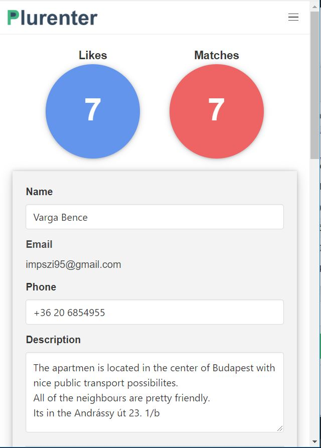
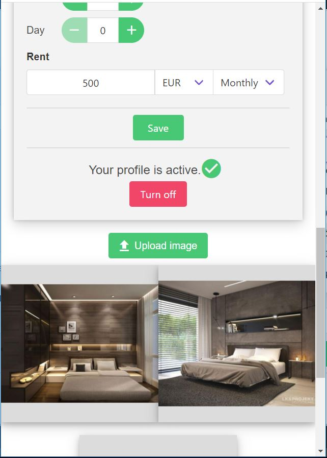
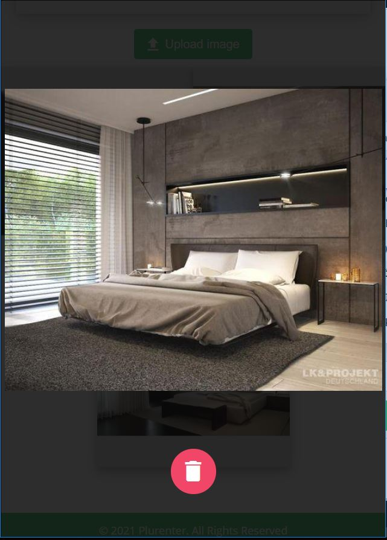
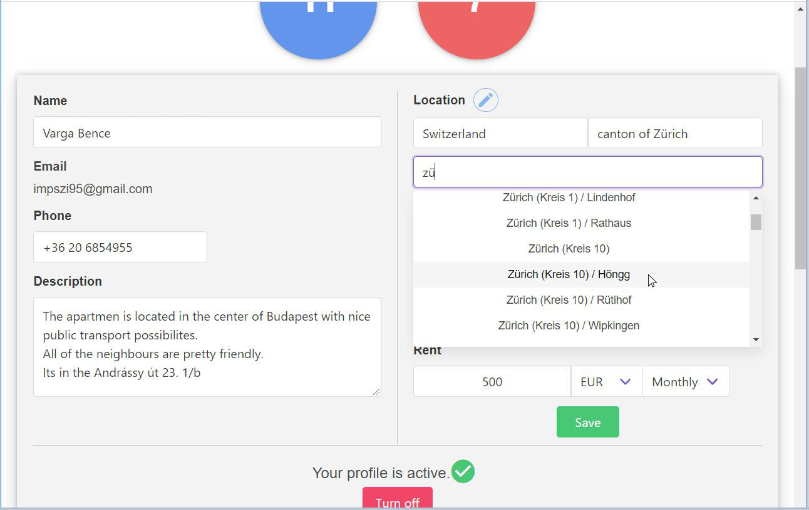

# Plurenter

> Find and rent an apartment faster and easier. 

## Table of contents
* [General info](#general-info)
* [Features](#features)
* [Technologies](#technologies
* [Contact](#contact)

## General info
It's becomming more and more difficult to find good tenants for landlords. On a traditional renting website, you get
 a ton of tenant requests, which results a bunch of time consuming on-side interviews by the time you filtering out the 
 right person, whom you are willing to rent your apartment.  
With Plurenter you can filter tenants and view their profile before get contacted, that helps you save time by contacting 
with the tenants who already fits for your requirements. The base matching procedure is similar to Tinder's.

## Features

Users can upload their images and fill their personal and filtering datas depending on whether she is a tenant or a landlord.

The whole app is responsive so everything is also optimized for mobiles and tablets.

Plurenter uses its own Location API. It makes possible to search apartments in any city, in all countries.

## Technologies
* Backend Services- JAVA, Sprign Boot 2.2.3
* FrontEnd - VueJS 2.6.11
* Running on Ubuntu with Docker

## Contact
Created by Varga Bence - impszi95@gmail.com  
[www.plurenter.ml](https://www.plurenter.ml/)