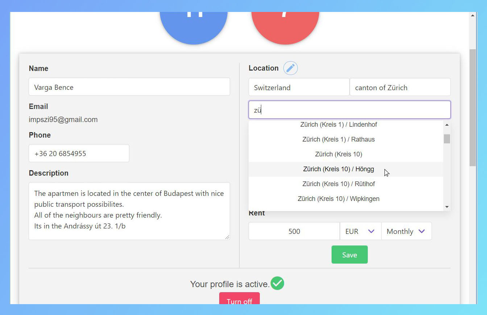
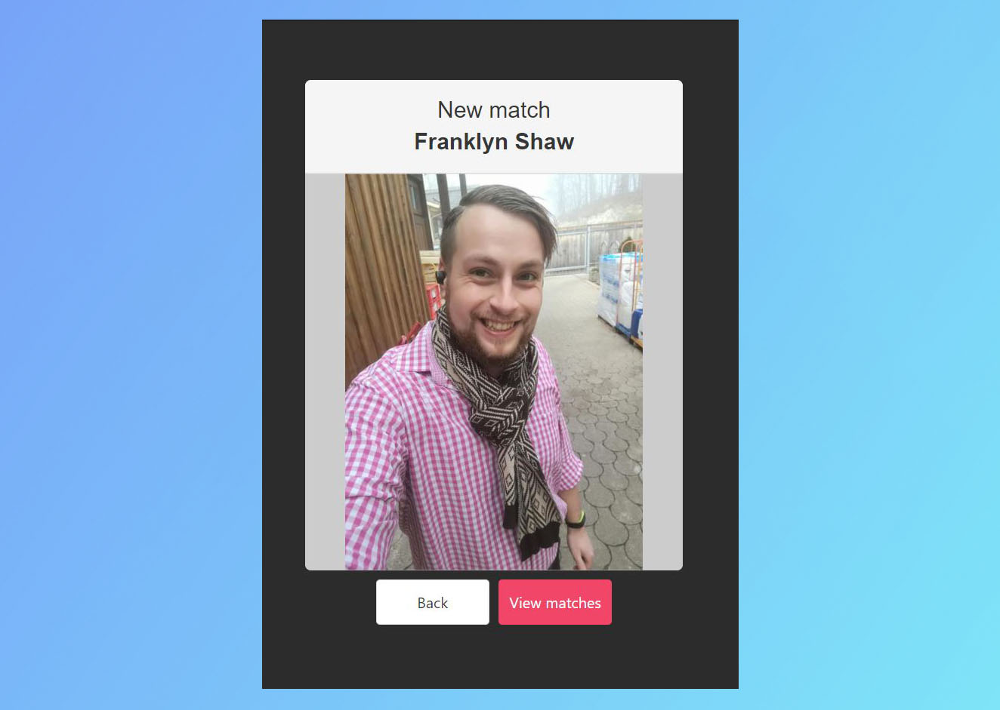
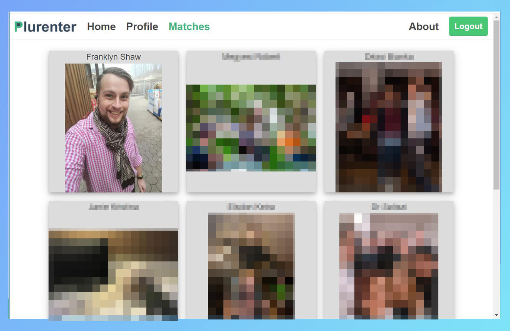

# Plurenter

> Find and rent an apartment faster and easier. 

## Table of contents
* [General info](#general-info)
* [Features](#features)
* [Technologies](#technologies)
* [Contact](#contact)

## General info
It's becoming more and more difficult for landlords to find good tenants. On a traditional renting website, you get a ton of tenant requests, which results in a bunch of time consuming on-site interviews by the time you filter out the right person whom you are willing to rent your apartment.  
With Plurenter you can filter tenants and view their profile before you get contacted, which helps you save time by only contacting those tenants who already fit your requirements. The base matching procedure is similar to Tinder's.

## Features
Users can upload their images and fill their personal and filtering data depending on whether they are tenants or landlords. 

  
The whole app is responsive so everything is also optimized for mobiles and tablets. 

  
Plurenter uses its own Location API. It makes it possible to search apartments in any city, in all countries. 

  

Plurenter's search engine randomly draws landlords to tenants, and tenants to landlords who satisfy the given parameters. 
A landlord and a tenant can see each other if:
* The landlord's apartment is in the city where the tenant is looking
* The tenant's minimum rental time is bigger or equal to the landlord's minimum rental time 

  

  

When both parties like each other and a match occurs, a Websocket API notifies both users.  

  

After they matched, users can see each other's contact informations. 

  
Plurenter was written to be highly scalable.

## Technologies
* Backend Services - Java, Spring Boot 2.2.3
* Frontend - VueJS 2.6.11
* Running on Ubuntu with Docker

## Contact
Created by Bence Varga - impszi95@gmail.com  
[www.plurenter.ml](https://www.plurenter.ml/)
